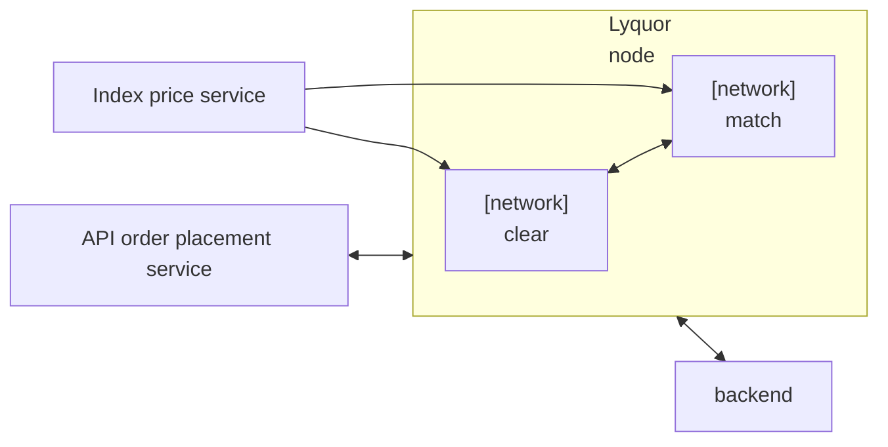

On February 27, the discussion combined three layers of the project that are usually hard to keep aligned at the same time: contract execution, day-to-day delivery discipline, and the longer-term system architecture. The result was a more grounded view of what had already been validated, where execution was slipping, and which architectural questions still needed sharper answers.

<!-- truncate -->

One part of the meeting focused on contract execution and testing. A devnet issue had previously caused abnormal behavior after the hub node had been running for too long or after too many contracts had been deployed. Resetting the `rocksdb` directory, restarting the devnet, and redeploying the contracts restored the basic swap tests. That helped separate environment instability from actual contract logic problems, which is important because the two can easily be confused during early validation.

We also clarified the contract interaction model behind the swap flow. The setup involves deploying two ERC20 contracts first and then deploying the basic swap contract with those token addresses. When a user swaps token A for token B, token A is sent into the swap contract, the contract computes the output amount, and token B is transferred to the designated recipient, which does not have to be the same as the calling address. This gave the team a cleaner mental model for reasoning about what exactly is being tested when swap behavior is verified.

At the same time, there were still open questions around order flow semantics. Two contracts had already been tested successfully for order placement and order-status queries, but the meaning of the `new` status was still not fully settled. In particular, the team questioned whether `new` reflected a state before matching, after matching, or simply after contract acceptance. That uncertainty matters because status transitions are not just UI details; they define how upstream and downstream services interpret execution.

Another useful clarification concerned atomicity. The discussion reinforced that a contract transaction either succeeds or fails as a whole, and a failed transaction should not leave the first contract in a partially updated state. That sounds basic, but it is a critical assumption when mapping contract execution back into a broader matching and clearing pipeline.

The meeting also forced a more honest view of project timing. A task that had originally been estimated at a little over one week had stretched close to three weeks, which made it clear that earlier estimates were too optimistic and did not leave enough buffer. The conclusion was not just to “work faster,” but to estimate in a way that is both practical and defensible, with enough slack to reflect real complexity instead of ideal execution.

That same realism carried over into task planning. Rather than scattering attention across too many tests and side explorations at once, the team aligned on focusing effort on the current critical path, especially around amend-order logic, DTO boundaries, and code-model consistency. The rough idea was to stop spending energy on peripheral verification before the core data model and execution path had been made stable enough to support it.

AI-assisted code analysis also came up as a tactical tool rather than a full replacement for engineering judgment. Instead of translating everything wholesale, the proposed approach was to use AI selectively: compare logic, highlight unreasonable parts, and help move specific behaviors into the current codebase without paying the cost of indiscriminate full-code translation. That is a more disciplined use of AI, and it fits the broader pattern of trying to preserve functional continuity while reducing wasted effort.

On the architecture side, one of the more interesting threads was whether an integrated high-core machine model might be more realistic than some of the more fragmented approaches under consideration. The argument was that putting clearing and matching together on a powerful multi-core system could still support large-scale usage even if single-contract performance remained limited. That idea was contrasted with another model that was seen as prone to internal congestion and operational instability.

In the nearer term, the implementation plan is more concrete. The team is preparing to turn the `clear` service and the `match` service into two separate Lyquid components, each with its own **network entry**, with the immediate goal of completing the Lyquor integration work required to make that structure operational. This gives the architecture discussion a practical next step: instead of debating abstraction in the abstract, the system can be pushed forward through an actual service-level integration path.

There was also a deeper disagreement about how node-level execution should be understood. One view was that different nodes could each run contract execution and then converge on a final result through consensus, which would make horizontal scaling possible. The other view emphasized network-wide consistency, where all transactions must be collected, ordered, and agreed on before block production. That distinction is fundamental because it changes how the team should think about execution parallelism, deployment boundaries, and the role of consensus in the final architecture.
