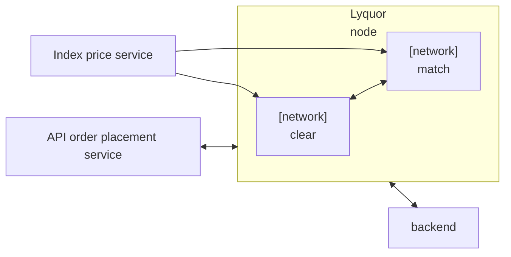
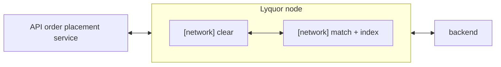

On March 9, the discussion moved the project toward a more unified architectural direction. Instead of continuing to think in terms of multiple Lyquid instances with pre-assigned responsibilities, the team aligned on a single-Lyquid design that could host multiple roles while sharing the same underlying state. That shift matters because it changes both the technical implementation path and the way different features, especially matching and index-price-related logic, are expected to coexist.

This diagram reflects the architecture concept discussed on February 27. See the earlier post [here](/2026-02-27-contract-testing-and-architecture-tradeoffs).

<!-- truncate -->

The core architectural conclusion was that one Lyquid should be able to support both index-price-related functionality and matching functionality at the same time. Rather than splitting these concerns across separate systems too early, the team favored a model where multiple nodes or roles operate within a shared structure, using common in-memory order book state while still taking on different tasks depending on node identity or execution role. In spirit, this moves the design closer to an instance-sharing model than to a collection of isolated services.

This updated diagram reflects the March 9 direction toward a single Lyquid architecture with matching and index-price-related logic combined inside the same node.

That decision immediately raised the importance of deterministic execution. Several implementation details that might be acceptable in a standalone service become problematic in a replicated network setting. UUID generation was the clearest example. If different nodes generate different UUIDs while replaying the same execution path, the system can diverge even when the surrounding business logic is identical. The conclusion was straightforward: UUID-based behavior has to be removed or replaced with a deterministic alternative that all nodes can reproduce.

The same constraint extends to time and randomness. In the network layer, taking the current time directly or relying on random-number generation introduces non-reproducible behavior that can break replay and consensus assumptions. Those details may sound small, but they are exactly the kind of implementation choices that become architectural problems once execution is expected to remain consistent across nodes.

At the same time, price ingestion and price computation are becoming central design concerns rather than secondary data feeds. The current direction is for proposer nodes to push index and mark-price related updates through the network path so that the resulting values can eventually be reflected in contract state. A simple ingestion path may be acceptable at first, but the discussion also made clear that the final price model will require more than just passing through a few external values.

That is partly because the required data is not trivial to reconstruct. One issue raised in the meeting was that the system could not directly retrieve the past 150 minutes of bid, ask, and last-trade values in the form needed for pricing logic. That means pricing may need to be coupled more tightly with matching or stored more directly inside the same contract-level structure instead of being treated as a purely external reference stream.

This is where the Hyperliquid research became especially relevant. The discussion noted that Hyperliquid's pricing model does not follow a simplistic formula. Mark price depends on a median across multiple values and appears to incorporate moving averages and weighted median logic. That means price logic is not just an oracle integration problem. It is also a modeling problem, because reproducing the behavior correctly requires understanding which data is stored, how it is aggregated, and where the computation should live.

Alongside those architecture questions, functional development continued to move forward. Order placement and cancellation were already working, while amend-order, trade execution, and richer query paths were still in progress. The short-term expectation was to complete amend and query support, regenerate Swagger documentation, and then move toward experiments where the order book could be combined with index-based calculations.

There was also a practical infrastructure lesson in the background. Some of the difficulties encountered during compilation and deployment appeared to be tied less to business logic than to environment mismatch, especially around macOS versus Ubuntu-based workflows. The proposed response was pragmatic: move more of the workflow into Docker or Ubuntu-like environments where deployment had already been shown to work, then resolve deterministic-execution issues such as UUID removal in a setting closer to the target runtime.

Taken together, the March 9 discussion sharpened a key engineering principle for the project: architecture is not just about deciding where features live. It is also about deciding which assumptions are allowed to exist inside a replicated execution model. The move toward a single Lyquid architecture therefore did more than simplify the diagram. It forced the team to treat determinism, pricing logic, and execution boundaries as part of the same design problem.
