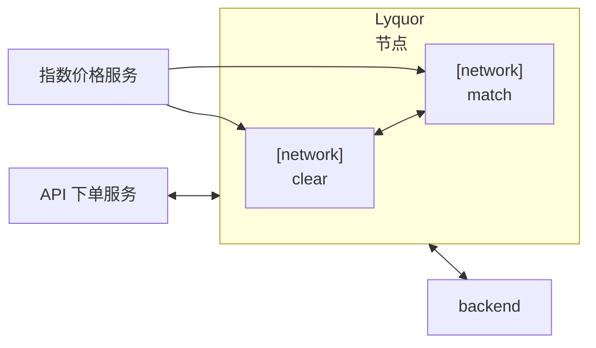

2 月 27 日的讨论把项目中通常很难同时对齐的三层问题放在了一起：合约执行、日常交付节奏，以及更长期的系统架构。结果是，团队对哪些内容已经验证、哪些执行环节正在拖慢进度、哪些架构问题还需要更清晰的答案，有了更接地气的判断。

<!-- truncate -->

会议的一部分重点放在合约执行和测试上。此前 devnet 出现过一个问题：hub 节点运行时间过长，或部署合约过多后，行为会变得异常。通过重置 `rocksdb` 目录、重启 devnet、重新部署合约，基础 swap 测试恢复正常。这有助于把环境不稳定和真实合约逻辑问题区分开来。早期验证中，这两类问题很容易混在一起。

我们也进一步明确了 swap 流程背后的合约交互模型。流程是先部署两个 ERC20 合约，再用这两个 token 地址部署基础 swap 合约。当用户用 token A 兑换 token B 时，token A 会进入 swap 合约，合约计算输出数量，再把 token B 转给指定接收方；这个接收方不一定要和调用地址相同。这个模型让团队更容易理解，在验证 swap 行为时到底测试的是什么。

与此同时，订单流转语义仍然有一些开放问题。两个用于下单和查询订单状态的合约已经成功测试过，但 `new` 状态的含义还没有完全定下来。团队特别讨论了 `new` 到底表示撮合前、撮合后，还是仅仅表示合约已经接受订单。这个不确定性很重要，因为状态流转不只是 UI 细节，它决定了上下游服务如何解释执行结果。

另一个有用的澄清是原子性。讨论再次确认，一笔合约交易要么整体成功，要么整体失败；失败交易不应该让第一个合约停留在部分更新的状态。这个假设听起来基础，但当合约执行要映射回更广泛的撮合和清算流程时，它是非常关键的前提。

会议也迫使团队更诚实地看待项目时间。一个原本估计一周多完成的任务，实际已经接近三周。这说明早期估算过于乐观，没有留出足够缓冲。结论并不是简单要求“更快完成”，而是要用更实际、可辩护的方式估算，把真实复杂度纳入时间计划，而不是只按理想执行情况估算。

这种现实感也延伸到了任务规划上。与其同时分散精力做太多测试和旁支探索，团队更倾向于把注意力集中在当前关键路径上，尤其是改单逻辑、DTO 边界和代码模型一致性。大致思路是，在核心数据模型和执行路径足够稳定之前，不要把太多精力消耗在外围验证上。

AI 辅助代码分析也被作为一种战术工具讨论，而不是工程判断的完整替代品。团队并不打算把所有代码整体翻译一遍，而是更有选择地使用 AI：比较逻辑、标出不合理之处，并帮助把具体行为迁移到当前代码库中，避免为无差别的全量代码翻译付出成本。这是一种更克制的 AI 使用方式，也符合当前保留功能连续性、减少无效投入的整体思路。

在架构侧，一个比较有意思的话题是，相比一些更碎片化的方案，集成在高核心数机器上的模型是否更现实。讨论中的观点是，把清算和撮合放在一台强大的多核系统上，即使单合约性能仍然有限，也可能支撑较大规模使用。这个想法和另一种被认为容易出现内部拥堵和运行不稳定的模型形成了对比。

更近一步的实现计划则更加具体。团队准备把 `clear` 服务和 `match` 服务做成两个独立的 Lyquid 组件，每个组件都有自己的 **network entry**，近期目标是完成让这个结构可运行所需的 Lyquor 集成工作。这样一来，架构讨论就有了实际下一步：不再只是在抽象层面讨论，而是通过真实的服务级集成路径继续推进系统。

会议中还有一个更深层的分歧：应该如何理解节点级执行。一种观点认为，不同节点可以各自运行合约执行，再通过共识收敛到最终结果，从而支持横向扩展。另一种观点强调全网一致性，也就是所有交易必须先被收集、排序并达成一致，然后才能产块。这个区别非常基础，因为它会改变团队对执行并行度、部署边界以及共识在最终架构中角色的理解。
