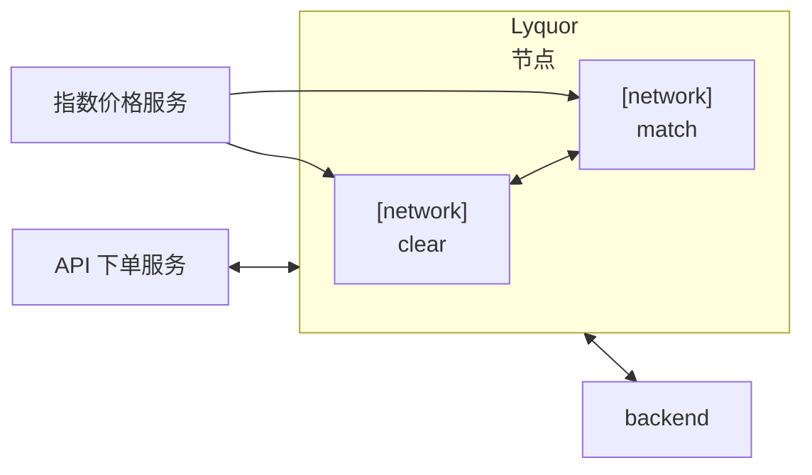
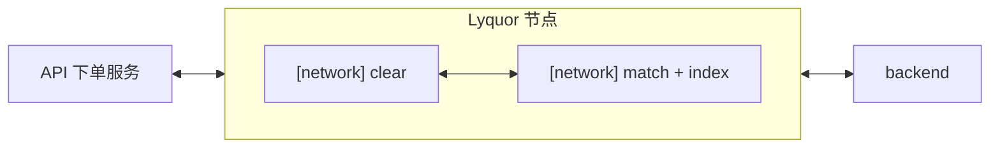

3 月 9 日的讨论把项目推向了一个更统一的架构方向。团队不再继续以“多个 Lyquid 实例分别承担预设职责”的方式思考，而是对齐到一个单 Lyquid 设计：同一个 Lyquid 可以承载多个角色，并共享同一份底层状态。这个变化很重要，因为它会同时影响技术实现路径，以及撮合、指数价格等不同功能应该如何共存。

这张图对应的是 2 月 27 日讨论过的架构概念。可以参考之前的文章：[02-27 合约测试与架构取舍](/zh-Hans/blog/2026-02-27-contract-testing-and-architecture-tradeoffs)。

<!-- truncate -->

这次的核心架构结论是，一个 Lyquid 应该能够同时支持指数价格相关功能和撮合功能。团队不希望过早把这些职责拆到不同系统里，而是更倾向于一种共享结构：多个节点或角色在同一套结构里运行，共用内存中的订单簿状态，同时根据节点身份或执行角色承担不同任务。从方向上看，这让设计更接近实例共享模型，而不是一组彼此隔离的服务。

这张更新后的图反映了 3 月 9 日的方向：走向单 Lyquid 架构，并把撮合与指数价格相关逻辑组合到同一个节点内部。

这个决定立刻凸显了确定性执行的重要性。一些在独立服务里可以接受的实现细节，一旦进入复制执行的网络环境，就会变成问题。UUID 生成是最清楚的例子。如果不同节点在重放同一条执行路径时生成不同 UUID，即使周围业务逻辑完全一致，系统也可能发生分叉。结论很直接：基于 UUID 的行为必须被移除，或者替换成所有节点都能复现的确定性方案。

同样的约束也适用于时间和随机数。在网络层中，直接读取当前时间或依赖随机数生成，会引入不可复现的行为，破坏重放和共识假设。这些细节看起来很小，但一旦执行结果需要在多个节点之间保持一致，它们就会变成架构问题。

与此同时，价格接入和价格计算正在从次要数据源变成核心设计问题。当前方向是让 proposer 节点通过网络路径推送指数价格和标记价格相关更新，使最终结果能够反映到合约状态中。早期可以先采用简单的数据接入路径，但讨论也明确指出，最终价格模型不能只是透传几个外部值。

原因之一是，所需数据本身并不容易重建。会议中提到的一个问题是，系统无法直接按定价逻辑需要的形式取回过去 150 分钟的 bid、ask 和 last trade 数据。这意味着价格逻辑可能需要更紧密地和撮合耦合，或者更直接地存储在同一套合约级结构中，而不能只被当作纯外部参考流。

这也是 Hyperliquid 研究变得特别相关的地方。讨论中提到，Hyperliquid 的定价模型并不是一个简单公式。标记价格依赖多个值的中位数，并且看起来还结合了移动平均和加权中位数逻辑。也就是说，价格逻辑不只是预言机接入问题，也是建模问题。要正确复现这种行为，需要理解哪些数据被存储、如何聚合，以及计算应该发生在哪里。

在这些架构问题之外，功能开发也继续推进。下单和撤单已经可以工作，改单、成交执行和更丰富的查询路径仍在推进。短期预期是完成改单和查询支持，重新生成 Swagger 文档，然后开始实验如何把订单簿和基于指数的计算结合起来。

背景中还有一个实际的基础设施经验。一些编译和部署困难看起来并不是业务逻辑本身导致的，而是环境不匹配造成的，尤其是 macOS 和 Ubuntu 工作流之间的差异。更实际的应对方式是，把更多工作流迁移到 Docker 或类 Ubuntu 环境里，因为部署已经在这些环境中被证明可行；然后再在更接近目标运行时的环境中解决 UUID 移除等确定性执行问题。

综合来看，3 月 9 日的讨论让项目的一条关键工程原则更清楚了：架构不只是决定功能放在哪里，也是在决定哪些假设可以存在于复制执行模型中。因此，走向单 Lyquid 架构不只是简化了图，它也迫使团队把确定性、价格逻辑和执行边界当成同一个设计问题来处理。
