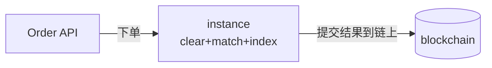

一开始，我们重构了 `clear-lyquid` 和 `match-lyquid`，现在它们都通过一个 `Lyquor` 实例作为入口来调用。所有状态都已经转换为实例级状态。整体思路是，多个实例先为一笔交易发起某种本地共识，然后再把结果提交到链上。

<!-- truncate -->

在这个阶段，我们遇到了一个问题：每次状态访问都涉及读写锁，这说明系统里存在竞争条件，也暗示这里可能需要一个多线程设计。

所以问题变成了：在这个上下文中，我们应该如何利用 `Lyquor` 提供的多线程能力？
